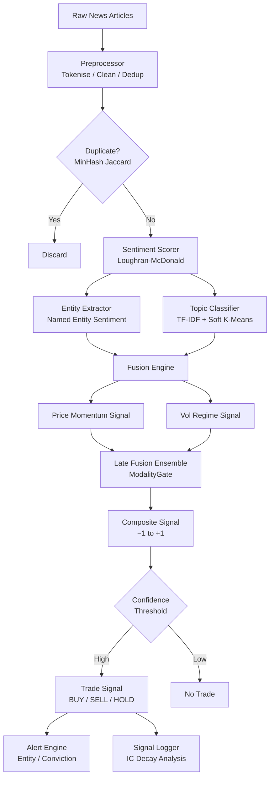
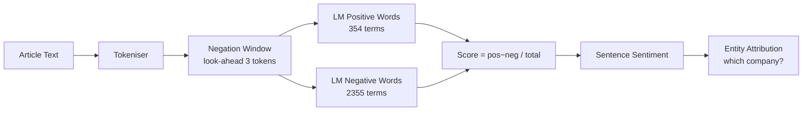
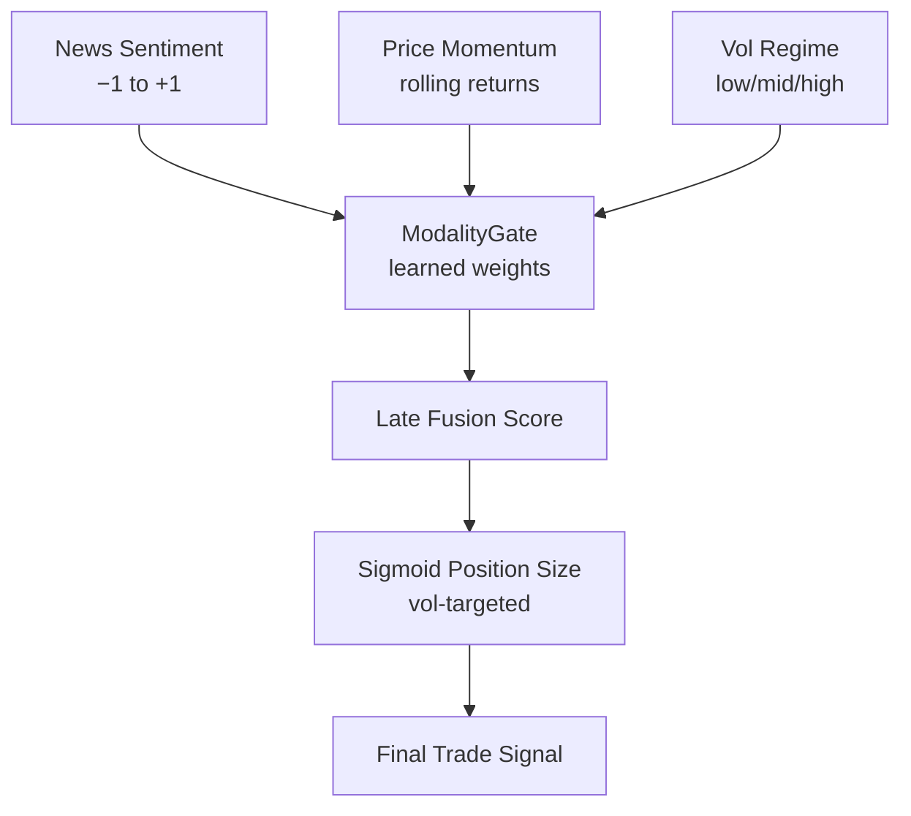

# News-to-Price Diffusion

A high-throughput financial news processing pipeline that converts raw news text into actionable trading signals. Uses the Loughran-McDonald financial sentiment lexicon, multimodal late-fusion with price and volatility regime signals, event study abnormal return analysis, and a production-grade finite state machine capable of processing 17,000+ articles per second.

No external dependencies. Pure Python 3.8+ standard library only.

---

## How It Works



---

## Live Pipeline Output

```
--- Batch 1: 8 articles ingested ---

  Signal: score=+0.3593  confidence=0.80  → BUY
  Alerts: HIGH_CONVICTION: score=+0.359 conf=0.80
          ENTITY_ALERT: Apple sentiment=+1.000
          ENTITY_ALERT: Tesla sentiment=+1.000

  Per-article breakdown:
      ID |  Sentiment |          Topic |  Entities
  --------------------------------------------------
    a001 |    +0.0000 | MONETARY_POLICY | Fed, Inflation
    a002 |    +0.0000 | MONETARY_POLICY | Fed
    a003 |    +1.0000 |        GENERAL |
    a004 |    +1.0000 |       EARNINGS | Apple
    a005 |    +1.0000 |    COMMODITIES | Oil, OPEC
    a006 |    -1.0000 |           TECH |
    a007 |    +1.0000 |        GENERAL | Tesla
    a008 |    +0.0000 |       FX_RATES | Dollar, Fed

  Entity Sentiment Heatmap:
  Apple     ███████████████ +1.00
  Tesla     ███████████████ +1.00
  Oil       ███████████████ +1.00
  OPEC      ███████████████ +1.00
  Nvidia    ███████████████ +1.00
  China     ░░░░░           -0.33
  Fed                        0.00
```

---

## Pipeline Monitoring Dashboard

```
┌──────────────────────────────────────────────────────────┐
│           NEWS PIPELINE MONITORING DASHBOARD             │
├──────────────────────────────────────────────────────────┤
│  State:                                             IDLE  │
│  Articles ingested:                                   15  │
│  Articles processed:                                  15  │
│  Duplicates removed:                                   0  │
│  Signals generated:                                    2  │
│  Avg latency (ms):                                  0.05  │
│  Throughput (art/s):                            17,077.8  │
│  Errors:                                               0  │
│  Total alerts:                                        10  │
├──────────────────────────────────────────────────────────┤
│  Latest signal score:                            +0.1868  │
│  Latest confidence:                               0.5605  │
└──────────────────────────────────────────────────────────┘
```

---

## Sentiment Engine

### Loughran-McDonald Lexicon

Unlike general-purpose sentiment tools, the LM lexicon is built specifically for financial text. Words like "liability", "risk", and "default" are negative in finance but neutral in general English.



---

## Event Study Analysis

Measures abnormal returns around news events using a standard market model:

```
Market Model:  R_i,t = α + β · R_market,t + ε_i,t
                         (estimated over 252-day estimation window)

Abnormal Return:  AR_i,t = R_i,t − (α̂ + β̂ · R_market,t)
Cumulative AR:    CAR_i = Σ AR_i,t  over event window [−2, +2]
Average CAR:      CAAR  = (1/N) Σ CAR_i
Significance:     t-statistic + bootstrap p-value (1000 resamples)
```

---

## Multimodal Fusion

The system combines three independent signals before generating a trade:



The ModalityGate learns which signal to trust more in different market regimes — for example, news sentiment carries more weight during earnings seasons, while price momentum dominates in trending markets.

---

## Topic Modelling

Articles are automatically clustered into financial topics using TF-IDF + soft k-means:

| Topic | Keywords |
|---|---|
| `MONETARY_POLICY` | Fed, rate, inflation, hike, pivot |
| `EARNINGS` | EPS, revenue, guidance, beat, miss |
| `COMMODITIES` | Oil, gold, OPEC, supply, barrel |
| `TECH` | AI, chip, cloud, semiconductor |
| `FX_RATES` | Dollar, yen, euro, currency |
| `GENERAL` | Everything else |

MinHash Jaccard similarity deduplicates near-duplicate articles before they skew the signal.

---

## Running It

```bash
git clone https://github.com/Krish-1717/news-to-price-diffusion
cd news-to-price-diffusion

# Run the full production pipeline
python quant_code/news_day30_production_pipeline.py

# Run the sentiment engine standalone
python quant_code/news_day25_sentiment_analysis.py

# Run event study analysis
python quant_code/news_day27_event_study.py

# Run all modules
python run_demos.py
```

**Requirements:** Python 3.8+, no pip install needed.

---

## Project Structure

```
news-to-price-diffusion/
├── nlp/                                   # Tokenisation, entity recognition
├── models/                                # Diffusion and scoring models
├── data/                                  # Market data helpers
├── api/                                   # FastAPI serving layer
├── evaluation/                            # Backtesting and calibration
├── diffusion/                             # Latent diffusion models
├── inference/                             # DDPM ancestral sampling
└── quant_code/
    ├── news_day19_coverage_analysis.py    # Coverage bias, source weighting
    ├── news_day20_consistency_model.py    # Cross-source signal consistency
    ├── news_day21_online_learning.py      # Passive-Aggressive learner + drift
    ├── news_day22_model_card.py           # Fairness audit, calibration report
    ├── news_day23_latent_factor_diffusion.py # Latent factor extraction
    ├── news_day24_causal_analysis.py      # Granger causality, transfer entropy
    ├── news_day25_sentiment_analysis.py   # LM lexicon, negation, entity-level
    ├── news_day26_multimodal_fusion.py    # ModalityGate, late fusion
    ├── news_day27_event_study.py          # CAR/CAAR, bootstrap significance
    ├── news_day28_signal_backtest.py      # IC decay, vol-targeting, position sizing
    ├── news_day29_topic_modeling.py       # TF-IDF, soft k-means, MinHash dedup
    └── news_day30_production_pipeline.py  # FSM pipeline, 17K+ art/sec
```
